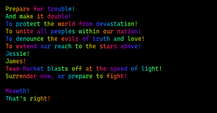

# Rainbow Text

A really simple function to just apply a cool rainbow effect to text provided in; built with Deno 🦕 but runs most places 🌈

## Example
This is the same for Deno, Bun or Node.js:
```typescript
import { rainbowText } from '@sadev/rainbow';

console.log(rainbowText("Hello World!"));
```


See [dinosaur.ts](./examples/dinosaur.ts) to produce:


See [rocket.ts](./examples/rocket.ts) to produce:


## Installation

`rainbow` is available on jsr:

*Deno*
```bash
deno add @sadev/rainbow
```
*npm*
```bash
npx jsr add @sadev/rainbow
```

*Bun*
```bash
bunx jsr add @sadev/rainbow
```

*Yarn*
```bash
yarn dlx jsr add @sadev/rainbow
```

*pnpm*
```bash
pnpm dlx jsr add @sadev/rainbow
```

## License

Licensed under the Apache License, Version 2.0. See [LICENSE](./LICENSE) for more.